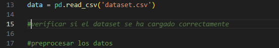
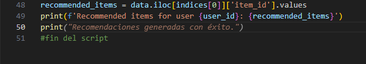
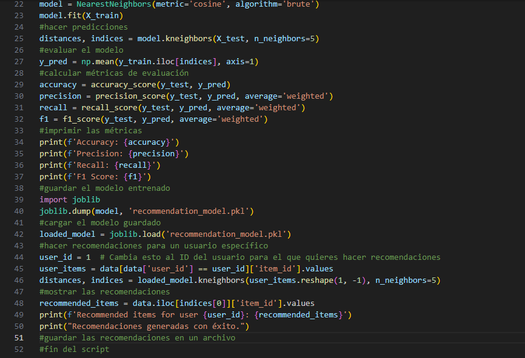

# Repositorio

https://github.com/xDarkZekromx/AI_Project.git

# AI_Project

# Comence a escribir lo que vi en el ejemplo, luego apretando TAB deje que el copilot dejará autocompletar todo lo que se ve en el archivo de python.

# Todo el codigo que se ve ahi, fue creado a base de apretar el TAB, de igual forma instale la libreria panda, numpy y scikit-learn.